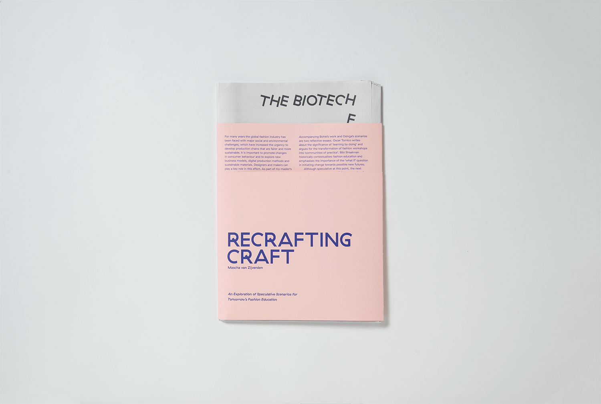

# Recrafting Craft

This project was based on hp-research-awards by Silvio Lorusso (https://github.com/silviolorusso/hp-research-awards).

## SETUP
Recrafting Craft, by Mascha van Zijverden, consists of 10 parts, all of somewhat equal importance. These parts are:
- Preface by Jose Teunissen;
- Introductory text by Mascha van Zijverden herself;
- 6 scenarios for future fashion education by Dirk Osinga, illustrated by Georg Bohle;
- 2 essays by Bibi Straatman and Oscar Tomico;

## PRINT
In the printed version Mascha’s part is used as a wrapper around all other parts, to emphasize the fact that she is the initiator and curator of this project. All other parts are printed on 7 different newspaper spreads. The newspaper is not stapled, so these parts have no particular order and are non-linear. 




## WEBPAGE
The setup for the webpage is a Side Navigation Menu with keywords and a Main Part with the content, the latter one is build up by 10 blocks [divs]. Each block contains one part (i.e. text or scenario). When opening the webpage all parts are in a specific order, set by the author. 

```
// The content of the blocks in variables
var biotech = document.getElementById("biotechschool").innerHTML,   
    natural = document.getElementById("naturalschool").innerHTML,
    high = document.getElementById("highschool").innerHTML,
    museum = document.getElementById("museumschool").innerHTML,
    engineer = document.getElementById("engineerschool").innerHTML,
    no = document.getElementById("noschool").innerHTML,
    oscar = document.getElementById("oscar").innerHTML,
    bibi = document.getElementById("bibi").innerHTML,
    mascha = document.getElementById("mascha").innerHTML,
    jose = document.getElementById("jose").innerHTML,
    dirk = document.getElementById("dirk").innerHTML,
    fibl = document.getElementById("fibl"),
    firstblock = document.getElementById("firstblock"),
    secondblock = document.getElementById("secondblock"),
    thirdblock = document.getElementById("thirdblock"),
    fourthblock = document.getElementById("fourthblock"),
    fifthlock = document.getElementById("fifthlock"),
    sixtblock = document.getElementById("sixtblock"),
    seventblock = document.getElementById("seventblock"),
    eightblock = document.getElementById("eightblock"),
    ninthblock = document.getElementById("ninthblock"),
    tentblock = document.getElementById("tentblock");

// On opening of page set standard order for the content in the blocks
window.onload = beginblocks()

// Reload function
function reload() {
    location.reload(); 
}

// The standard order for when the page is opened
function beginblocks() {
    fibl.innerHTML = jose;
    firstblock.innerHTML = mascha;
    secondblock.innerHTML = dirk;
    thirdblock.innerHTML = biotech;
    fourthblock.innerHTML = engineer;
    fifthlock.innerHTML = museum;
    sixtblock.innerHTML = high;
    seventblock.innerHTML = natural;
    eightblock.innerHTML = no;
    ninthblock.innerHTML = bibi;
    tentblock.innerHTML = oscar;
    scrollTop(fibl);
}
```

The Side Navigation Menu consists of all the keywords in alphabetical order. Each part has serval keywords, but these connections are only visible after clicking one of the keywords.

The content of the blocks changes when a Side Navigation Menu Item is clicked. After a button is clicked the corresponding part is placed in the first block. The other parts are placed in a random order in the remaining 9 blocks. Also, the ‘active’ keyword is turned blue, and well are the other connected keywords.


```
// Place all content except the clicked item in an array, randomise the order in the array so each item has a random number. Combine number with a block and place the content.
function changeText(id, a) {
    var arr = [biotech, natural, high, museum, engineer, no, oscar, bibi, mascha, jose, dirk];
    var arr2 = [];
    if(a === biotech) {
        var b = biotech;
        arr.splice(0, 1);
        arr2 = shuffle(arr);
    }
    else if(a === natural) {
        var b = natural;
        arr.splice(1, 1);
        arr2 = shuffle(arr);
    }
    else if(a === high) {
        var b = high;
        arr.splice(2, 1);
        arr2 = shuffle(arr);
    }
    else if(a === museum) {
        var b = museum;
        arr.splice(3, 1);
        arr2 = shuffle(arr);
    }
    else if(a === engineer) {
        var b = engineer;
        arr.splice(4, 1);
        arr2 = shuffle(arr);
    }
    else if(a === no) {
        var b = no;
        arr.splice(5, 1);
        arr2 = shuffle(arr);
    }
    else if(a === oscar) {
        var b = oscar;
        arr.splice(6, 1);
        arr2 = shuffle(arr);
    }
    else if(a === bibi) {
        var b = bibi;
        arr.splice(7, 1);
        arr2 = shuffle(arr);
    }
    else if(a === mascha) {
        var b = mascha;
        arr.splice(8, 1);
        arr2 = shuffle(arr);
    }
    else if(a === jose) {
        var b = jose;
        arr.splice(9, 1);
        arr2 = shuffle(arr);
    }
    else if(a === dirk) {
        var b = dirk;
        arr.splice(10, 1);
        arr2 = shuffle(arr);
    }
    id.innerHTML = b;
    firstblock.innerHTML = arr2[0];
    secondblock.innerHTML = arr2[1];
    thirdblock.innerHTML = arr2[2];
    fourthblock.innerHTML = arr2[3];
    fifthlock.innerHTML = arr2[4];
    sixtblock.innerHTML = arr2[5];
    seventblock.innerHTML = arr2[6];
    eightblock.innerHTML = arr2[7];
    ninthblock.innerHTML = arr2[8];
    tentblock.innerHTML = arr2[9];
    scrollTop(fibl);
    var arr = [biotech, natural, high, museum, engineer, no, oscar, bibi, mascha, jose, dirk];
    var $easyzoom = $('.easyzoom').easyZoom();
}
```

### SIDE NAVIGATION MENU
The Side Navigation Menu has 3 components: 
- A ‘home’ button, which takes you back to the fullscreen landing page;
- Contents, which is collapsed by default and consists of all parts by title.
- Index, which consists of all keywords in alphabetical order.

### THE CODE
Each keyword or chapter in contents is a button with two functions with parameters and one closing function. 

Example of a keyword button:
```<button class="jose" onclick="changeText(fibl, jose); chbg(josec); closeNav()">&mdash; Preface - José Teunissen</button>```

- When a button is clicked the first function [changeText] changes the content of the first block on the page [fibl] with the content of the second parameter [set as a VAR in bundle.js]. 
- The second function [chbg] changes all the connected keywords blue when one of them is clicked. The parameter connects the keywords that belong to one part.
- The close function [closeNav] closes the Side Navigaition Menu after a keyword is clicked and the order of the texts is shifted.


### MAIN PART
In the main parts all parts come together. 
The preface, introductory text and essays are all straight up texts, formatted in CSS and HTML.
The scenarios consist of a few elements:
- Title
- Subtitle
- Illustration
- Explanatory text

The illustrations use the Easyzoom function, with a few amendments. The 'standard' Easyzoom function enlarges an image when a user hovers a smaller version of the image. For this project an 'on-click light-box' was used, to enable the user to scroll through the whole page without being disturbed by pop-up light boxes. When an image is clicked, the large, zoomed image pops up in a light-box. In here the zoomed image can be studied. This way all details and small lines are visible.

```
// EASYZOOM BY I LIKE ROBOTS
/*!
 * @name        easyzoom
 * @author      Matt Hinchliffe <>
 * @modified    Tuesday, February 14th, 2017
 * @version     2.5.0
 */
 // Edited by studio MEGAN (www.studiomegan.nl)

(function (root, factory) {
    'use strict';
    if(typeof define === 'function' && define.amd) {
        define(['jquery'], function($){
            factory($);
        });
    } else if(typeof module === 'object' && module.exports) {
        module.exports = (root.EasyZoom = factory(require('jquery')));
    } else {
        root.EasyZoom = factory(root.jQuery);
    }
}(this, function ($) {

    'use strict';

    var dw, dh, rw, rh, lx, ly;

    var defaults = {

        // The text to display within the notice box while loading the zoom image.
        loadingNotice: 'Loading image',

        // The text to display within the notice box if an error occurs when loading the zoom image.
        errorNotice: 'The image could not be loaded',

        // The time (in milliseconds) to display the error notice.
        errorDuration: 2500,

        // Attribute to retrieve the zoom image URL from.
        linkAttribute: 'href',

        // Prevent clicks on the zoom image link.
        preventClicks: true,

        // Callback function to execute before the flyout is displayed.
        beforeShow: $.noop,

        // Callback function to execute before the flyout is removed.
        beforeHide: $.noop,

        // Callback function to execute when the flyout is displayed.
        onShow: $.noop,

        // Callback function to execute when the flyout is removed.
        onHide: $.noop,

        // Callback function to execute when the cursor is moved while over the image.
        onMove: $.noop

    };

    /**
     * EasyZoom
     * @constructor
     * @param {Object} target
     * @param {Object} options (Optional)
     */
    function EasyZoom(target, options) {
        this.$target = $(target);
        this.opts = $.extend({}, defaults, options, this.$target.data());

        this.isOpen === undefined && this._init();
    }

    /**
     * Init
     * @private
     */
    EasyZoom.prototype._init = function() {
        this.$link   = this.$target.find('span');
        this.$image  = this.$target.find('img');

        this.$flyout = $('<div class="easyzoom-flyout" />');
        this.$closebtn = $('<a id="closebtn" href="javascript:void(0)" class="closebtn" >&times;</a>');
        this.$notice = $('<div class="easyzoom-notice" />');

        this.$target.on({
            'mousemove.easyzoom touchmove.easyzoom': $.proxy(this._onMove, this),
            'mousedown.easyzoom touchstart.easyzoom': $.proxy(this._onEnter, this),
            'mousedown.easyzoom-flyout': $.proxy(this._onClick, this),
            'mousedown.closebtn': $.proxy(this._onClick, this)
        });

        this.opts.preventClicks && this.$target.on('click.easyzoom', function(e) {
            e.preventDefault();
        });
    };

    /**
     * Show
     * @param {MouseEvent|TouchEvent} e
     * @param {Boolean} testMouseOver (Optional)
     */
    EasyZoom.prototype.show = function(e, testMouseOver) {
        var w1, h1, w2, h2;
        var self = this;

        if (this.opts.beforeShow.call(this) === false) return;
        $('body').css('overflow','hidden');

        if (!this.isReady) {
            return this._loadImage(this.$link.attr(this.opts.linkAttribute), function() {
                if (self.isMouseOver || !testMouseOver) {
                    self.show(e);
                }
            });
        }

        this.$target.append(this.$flyout);

        w1 = this.$target.width();
        h1 = this.$target.height();

        w2 = this.$flyout.width();
        h2 = this.$flyout.height();

        dw = this.$zoom.width() - w2;
        dh = this.$zoom.height() - h2;

        this.$target.append(this.$closebtn);

        // For the case where the zoom image is actually smaller than
        // the flyout.
        if (dw < 0) dw = 0;
        if (dh < 0) dh = 0;

        rw = dw / w1;
        rh = dh / h1;

        this.isOpen = true;

        this.opts.onShow.call(this);

        e && this._move(e);
    };

    /**
     * On enter
     * @private
     * @param {Event} e
     */
    EasyZoom.prototype._onEnter = function(e) {
        var touches = e.originalEvent.touches;

        this.isMouseOver = true;

        if (!touches || touches.length == 1) {
            e.preventDefault();
            this.show(e, true);
        }
    };

    /**
     * On move
     * @private
     * @param {Event} e
     */
    EasyZoom.prototype._onMove = function(e) {
        if (!this.isOpen) return;

        e.preventDefault();
        this._move(e);
    };

    /**
     * On leave
     * @private
     */
    EasyZoom.prototype._onLeave = function() {
        this.isMouseOver = false;
        this.isOpen && this.hide();
    };

    EasyZoom.prototype._onClick = function() {
        if (!this.isOpen) return;
        if (this.opts.beforeHide.call(this) === false) return;

        this.isReady = false;

        this.$flyout.detach();
        this.$closebtn.detach();
        this.isOpen = false;

        this.opts.onHide.call(this);
        $('body').css('overflow','auto');

    };

    /**
     * On load
     * @private
     * @param {Event} e
     */
    EasyZoom.prototype._onLoad = function(e) {
        // IE may fire a load event even on error so test the image dimensions
        if (!e.currentTarget.width) return;

        this.isReady = true;

        this.$notice.detach();
        this.$flyout.html(this.$zoom);
        this.$target.removeClass('is-loading').addClass('is-ready');

        e.data.call && e.data();
    };

    /**
     * On error
     * @private
     */
    EasyZoom.prototype._onError = function() {
        var self = this;

        this.$notice.text(this.opts.errorNotice);
        this.$target.removeClass('is-loading').addClass('is-error');

        this.detachNotice = setTimeout(function() {
            self.$notice.detach();
            self.detachNotice = null;
        }, this.opts.errorDuration);
    };

    /**
     * Load image
     * @private
     * @param {String} href
     * @param {Function} callback
     */
    EasyZoom.prototype._loadImage = function(href, callback) {
        var zoom = new Image;

        this.$target
            .addClass('is-loading')
            .append(this.$notice.text(this.opts.loadingNotice));

        this.$zoom = $(zoom)
            .on('error', $.proxy(this._onError, this))
            .on('load', callback, $.proxy(this._onLoad, this));

        zoom.style.position = 'absolute';
        zoom.src = href;
    };

    /**
     * Move
     * @private
     * @param {Event} e
     */
    EasyZoom.prototype._move = function(e) {

        if (e.type.indexOf('touch') === 0) {
            var touchlist = e.touches || e.originalEvent.touches;
            lx = touchlist[0].pageX;
            ly = touchlist[0].pageY;
        } else {
            lx = e.pageX || lx;
            ly = e.pageY || ly;
        }

        var offset  = this.$target.offset();
        var pt = ly - offset.top;
        var pl = lx - offset.left;
        var xt = Math.ceil(pt * rh);
        var xl = Math.ceil(pl * rw);

        // Close if outside
        if (xl < 0 || xt < 0 || xl > dw || xt > dh) {
            //this.hide();
        } else {
            var top = xt * -1;
            var left = xl * -1;

            this.$zoom.css({
                top: top,
                left: left
            });

            this.opts.onMove.call(this, top, left);
        }

    };

    /**
     * Hide
     */
    EasyZoom.prototype.hide = function() {
        if (!this.isOpen) return;
        if (this.opts.beforeHide.call(this) === false) return;

        this.$flyout.detach();
        this.isOpen = false;

        this.opts.onHide.call(this);
        $('body').css('overflow','auto');
    };

    /**
     * Swap
     * @param {String} standardSrc
     * @param {String} zoomHref
     * @param {String|Array} srcset (Optional)
     */
    EasyZoom.prototype.swap = function(standardSrc, zoomHref, srcset) {
        this.hide();
        this.isReady = false;

        this.detachNotice && clearTimeout(this.detachNotice);

        this.$notice.parent().length && this.$notice.detach();

        this.$target.removeClass('is-loading is-ready is-error');

        this.$image.attr({
            src: standardSrc,
            srcset: $.isArray(srcset) ? srcset.join() : srcset
        });

        this.$link.attr(this.opts.linkAttribute, zoomHref);
    };

    /**
     * Teardown
     */
    EasyZoom.prototype.teardown = function() {
        this.hide();

        this.$target
            .off('.easyzoom')
            .removeClass('is-loading is-ready is-error');

        this.detachNotice && clearTimeout(this.detachNotice);

        delete this.$link;
        delete this.$zoom;
        delete this.$image;
        delete this.$notice;
        delete this.$flyout;

        delete this.isOpen;
        delete this.isReady;
    };

    // jQuery plugin wrapper
    $.fn.easyZoom = function(options) {
        return this.each(function() {
            var api = $.data(this, 'easyZoom');

            if (!api) {
                $.data(this, 'easyZoom', new EasyZoom(this, options));
            } else if (api.isOpen === undefined) {
                api._init();
            }
        });
    };
}));
```

---------------

## Acknowledgements
A few standards where used in this project:
- [jQuery](https://jquery.com/)
- [Easyzoom](https://github.com/i-like-robots/EasyZoom)
- [Flickity](https://flickity.metafizzy.co/)

> Due to copyright the font Haptik is not included in this repository. 
